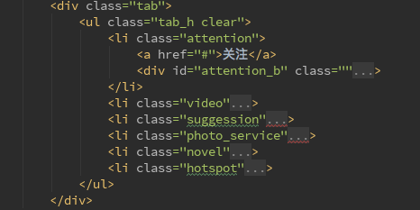
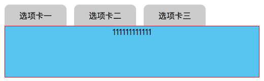
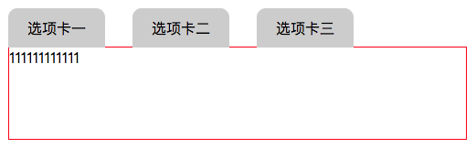
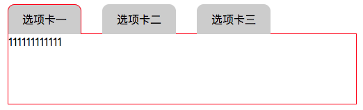

[TOC]

## 1.getBoundingClientRect()

## 2.获得鼠标的位置信息

## 3.防抖

## 4.节流

## 5.懒加载

JavaScript 类数组对象

1️⃣转换
如果类数组对象需要转化为数组，可以用 Array.prototype.slice.call

```javascript
var foo = {
    0: 'Java',
    1: 'Python',
    2: 'Scala',
    length: 3
}

var arr = Array.prototype.slice.call(foo);
```

第一， `foo` 本来是没有 `slice` 方法的， `Array.prototype.slice.call(foo)` 这个表达式相当于赋予 `foo` 这个对象 `slice` 方法。

第二， `Array.prototype.slice.call(foo);` 相当于 `Array.prototype.slice.call(foo, 0);` 是把取一个数组（或者类数组）的子集，并作为一个数组返回。所以当后面的作用对象是一个类数组时，就会把这个类数组对象转换为了一个新的数组。

2️⃣特性

类数组只有索引值和长度，没有数组的各种方法，所以如果要类数组调用数组的方法，就需要使用 `Array.prototype.method.call` 来实现。

例如，如果遍历一个类数组，可以这样实现：

```javascript
Array.prototype.forEach.call(foo, function(item){
    console.log(item);
});
```

添加一个元素

```javascript
Array.prototype.push.call(foo, 'PHP');
// foo = {0: "Java", 1: "Python", 2: "Scala 111", 3: "PHP", length: 4}
```

总结：

**call，apply，bind的本质是给对象添加一个新的方法，让这个对象能够调用这个方法**

## 6.无缝滚动——scrollTop/srollLeft

element.scrollLeft;滚动条到元素左边的距离

实现的无缝滚动，有两种基本的思想：
第一种：通过父元素的scrollLeft/scrollTop逐渐增加来实现；
第二种：通过css3的translate来实现，这里采用的第二种；

滚动动画实现：主要运用animation动画：

```
    @keyframes move{
		0%{transform:translateX(0px);}
		100%{transform:translateX(-2400px);}
    }
```

这里100%的时候移动的距离是你一次性想要展示的所有图片的宽度，并不是ul的宽度；

(1)方法一：当滚动到末尾，将scrollLeft设为0

(2)方法二：利用两个内容相同的div，当第一个div消失，立即让第一个div的scrollLeft为0，由于有第二个一模一样的内容，所以看起来是连续的

这里有两个div，所以当wrap.scrollLeft >= startWidth时，第一个div完全移动到框外，视图区为第二个div，此时再移#回到第一个div

(3)实例三在实例二的基础上进行了部分改进，原理相同

## 7.无缝滚动插件——seamless-scroll

注：这是一个轻量级的小插件，非常适用于跑马灯等要求不高的无缝滚动，cdn有点问题，可以将插件的js**下载到本地使用

## 8.百度索索建议API

1️⃣直接返回json数据

http://suggestion.baidu.com/?wd=关键词&action=opensearch

2️⃣json数据当做回调函数的参数传回来
http://suggestion.baidu.com/?wd=关键词

默认回调函数名是window.baidu.sug

等价于

http://suggestion.baidu.com/?wd=关键词&cb=window.baidu.sug

3️⃣http://suggestion.baidu.com/?wd=关键词&cb=自定义函数名


遇到的问题：

```javascript
fetch('http://suggestion.baidu.com/?wd='+this.value+'&action=opensearch',
    {mode: 'no-cors'})
    .then(function (res) {
         return res.json()
    })
    .then(function (res_json) {
         console.log(res_json);
    })
```

后台服务器没设cors，mode="cors"，会报错。
这个时候，你 fetch 改成了mode='no-cors' 表示不垮域，可以请求成功，单你拿不到服务器返回数据，它被标记了'opaque'，network是有请求成功的记录

针对跨域请求，cors模式是常见跨域请求实现，但是fetch自带的no-cors跨域请求模式则较为陌生，该模式有一个比较明显的特点：

该模式允许浏览器发送本次跨域请求，但是不能访问响应返回的内容，这也是其response type为opaque透明的原因。

也就是说，**这个接口后台不支持跨域请求**

解决：其他跨域方法

方法一：jsonp，success

bug1：定义jsonp方法时，传到参数对象中的回调函数的属性名必须是cb(这个例子必须是)

bug2：调用jsonp方法时，传给回调函数代表的属性名的属性值必须是一个字符串

Bug3：批量插入多个元素时，用字符串拼接的方法，只在最后插入一次

方法二：nginx反向代理(这个只适合测试页面，实际项目中不可能启动一个nginx)

原理：通过nginx配置一个代理服务器，域名与本地相同，端口不同，设置为允许跨域，本地访问代理服务器，代理服务器访问要访问的地址。因为跨域是请求结果被浏览器拦截，不是请求失败，所以用服务器发起请求就不会被拦截，服务器接受到请求结果再把结果传给本地请求即可

安装nginx：brew install nginx 

配置文件地址： /usr/local/etc/nginx/nginx.conf

启动nginx：nginx

重新启动： nginx -s reload

测试nginx语法是否错误：nginx -t

关闭nginx： nginx -s stop

bug：配置nginx时，server_name可以是自定义的域名，可以是127.0.0.1，就是不能是**localhost**

## 9.秒表计时器

注意：(1)开始计时器要加清浮动，否则每次点击都会创建一个新的计时器，造成累加效果，秒表越跑越快

​            (2)时分秒在计算之后要取余，否则会超过60/24

## 10.轮播图


## 11.tab标签页

### （1）css实现标签页：

原理：利用display:none;或者position:absolute或opacity:0;，触发时display:block;或者z-index增大，display:none;布局更简单

以下都使用display:none;

#### 方法一：利用hover选择器 

- 缺点：只有鼠标在元素上面的时候才有效果，无法实现选中和默认显示某一个的效果

HTML布局：**滑动门布局**

原因：选择器只能拿到hover元素的子元素



CSS：当鼠标移动到 li 上时，li 上有新样式并且li下的div显示出来，非当前li下的div都隐藏display:none;

难点：内容div要相对于tab进行布局

```css
            .tab {
                width: 600px;
                height: 300px;
                /* background: #fcf; */
                margin: 0 auto;
                position: relative;       /*做定位父元素*/
            }

            .tab_h {
                box-sizing: border-box;
                /* background: #acf; */
            }

            .tab_h li {
                padding: 10px 0;
                float: left;
                text-align: center;
                /* height: 0; */
            }
            .tab_h li a {
                display: inline-block;
                color: #ccc;
                padding: 5px 32px;
            }

            .tab_h li:hover a {
                border-radius: 20px;
                color: #5fc4f3;
                background: springgreen;
            }
            .tab_h li > div {
                height: 50px;
                line-height: 50px;
                position: absolute;
                left: 0;
                top: 50px;
                width: 600px;
                display: none;
            }
						/*当鼠标移动到li上，lix*/
            .tab_h li:hover > div {
                display: block;
            }
```


#### 方法二：利用a标签的锚点 + :target选择器

本质：锚点

- 缺点：因为锚点会将选中的元素滚动到页面最上面，每次切换位置都要移动，体验极差。
- 首次加载没有默认值

bug：写选择器时不能只写一个:target，必须加上父选择器，否则权重不够

```css
.tab_b>div:target {
    display: block;
}
```

样式会应用到锚点指定的内容区

#### 方法三：利用label和radio的绑定关系以及radio选中时的:checked

```css
/* 匹配任意被勾选/选中的radio(单选按钮),checkbox(复选框),或者option(select中的一项) */
```

来实现效果 

- 缺点：HTML结构元素更复杂

经过实验发现第三种方法达到的效果最好。所以下面讲一下第三种实现的方法。

这种方法的写法不固定，我查资料的时候各种各样的写法都有一度让我一头雾水的。最后看完发现总体思路都是一样的，无非就是下面的几个步骤。

1. 绑定label和radio：这个不用说id和for属性绑定
2. 隐藏radio按钮：这个方法有很多充分发挥你们的想象力就可以了，我见过的方法有设置`display:none;`隐藏的、设置**绝对定位，将left设置为很大的负值**，移动到页面外达到隐藏效果、设置**绝对定位：使元素脱离文档流，然后`opacity: 0;`**设置为透明来达到隐藏效果。
3. 隐藏多余的tab页：和上面同理，还可以通过`z-index`设置层级关系来相互遮挡。
4. 设置默认项：在默认按钮上添加`checked="checked"`属性
5. 设置选中效果：利用+选择器 和 ~选择器来设置选中对应元素时下方的tab页的样式，来达到选中的效果


问题1：div相对于公共父元素ul绝对定位，如果给li设置定位，选项卡不能压在div上，原因子压父，只有同一层级的可以设置层级进行比较，所以应该在div的同一层级设置z-index，应该设置在label上



**在写样式时，如果有子元素，父元素只负责位置，具体样式都设置在子元素上**，在本例中，li只负责定位，具体样式设置在子元素label上



问题2：当input:checked时，label显示左，上，右边框，去背景，其他label如果显示底边框会超出1px

解决：只有当label被激活时，再让它压div，否则，让div压label

问题3：给label设置了relative，div设置了absolute；本应该后一个压前一个，但是前一个压在了后一个上

```html
<label class="test-label" for="testTabRadio3">选项卡三</label>
<div class="tab-box">33333333333333</div>
```



原因待查找。。。。

解决方法：将给label设置了relative移到激活状态下，或者给给label的relative和div的absolute；设置z-index

默认堆叠效果：（1）平级元素-后来者居上；（2）**子元素压在父元素之上----子压父**

注意：（1）取值可以为负，取值为负时，当前元素会位于页面正常显示内容之下

​           （2）z-index 是无法改变父子关系的堆叠顺序：**子元素始终压在父元素之上------子压父**

​           （3）只有有定位的元素可以使用z-index，只能作用在relative、absolute、fixed定位的元素上


