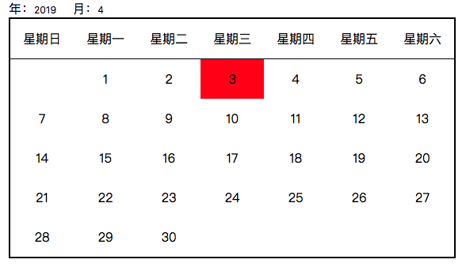

1.简单的日历控件

效果图：

实现原理：日历供五行七列，整体为浮动布局，通过改变1的位置实现同级元素的整体移动

JS：简易日历的JS逻辑总共需要4个步骤

【1】根据年月获得当月天数，根据当日为当月的第几天添加默认样式

当月天数：

2月：28/29

1,3,5,7,8,10,12：31

2,4,6,9,11：30

【2】根据当月第一天的星期，改变第一天的margin-left值，移动第一天到对应的位置；由于浮动的关系，其余天也会跟着移动到对应的位置

【3】根据当月的天数，隐藏多余的天；当然，隐藏之前要先显示在其他月份可能被隐藏的天

【4】载入页面后，获取当前的年和月，显示当月日历；当改变年或月时，获取改变后的值，更新日历